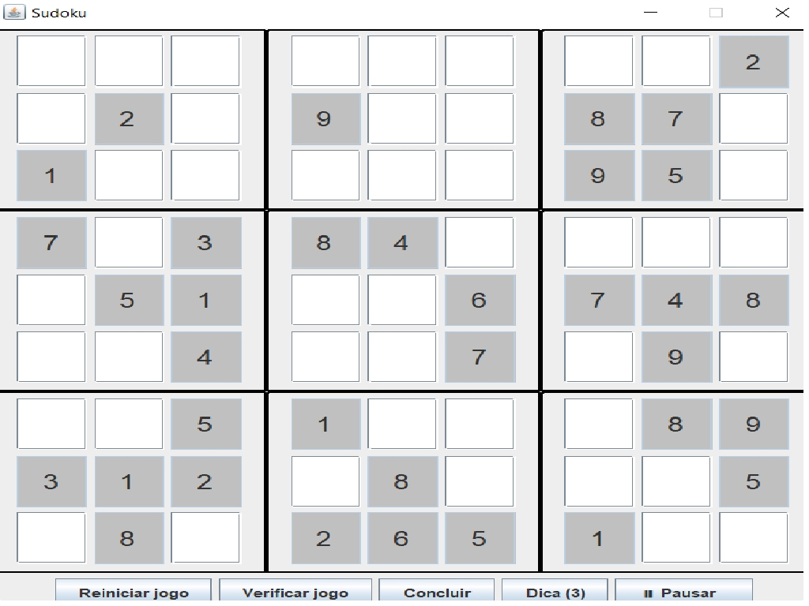

# SUDOKU- Jogo de Tabuleiro com Interface Gráfica

Desenvolvido em Java, com interface gráfica usando Swing. 

O objetivo é preencher o tabuleiro com os valores corretos, respeitando as regras definidas. 

Algumas células são fixas e não podem ser alteradas pelo jogador.

### Como baixar o projeto para jogar com interface gráfica

1. Certifique-se de que o Java está instalado no seu computador  
   👉 [Baixar Java](https://www.java.com/pt-BR/download/)

2. Baixe o arquivo `.jar` na aba [Releases](https://github.com/QSoll/sudoku-java/releases)

3. Clique duas vezes no arquivo para abrir o jogo

> Ao iniciar, você verá uma janela para escolher o nível de dificuldade: Fácil, Médio ou Impossível.

________________________________

Você pode baixar o projeto diretamente como ZIP:

1. Acesse o repositório: [github.com/QSoll/sudoku-java](https://github.com/QSoll/sudoku-java)
2. Clique no botão verde acima **Code**
3. Selecione **Download ZIP**
4. Extraia o arquivo e abra na sua IDE Java
---

## Funcionalidades iniciais já existentes
(Bootcamp Santander 2025 - Back-End com Java)

- Criação de tabuleiro 5x5
- Células fixas com valores pré-definidos
- Validação de jogadas
- Interface gráfica simples com botões e campos de entrada
- Exibição de mensagens de erro ou sucesso
- Reinício do jogo

---

## Funcionalidades implementadas

- Método `initBoard()` corrigido para inicializar células fixas com `new Space(valor, true)`

- Interpretação de configuração via `positionConfig` (ex: `"A1;B2;C3"`)

- Prevenção de alterações em células fixas

- Organização do código em classes como `BoardService`, `Space`, e `GameWindow`

- Interface gráfica responsiva com atualização dinâmica do tabuleiro

---

## Como instalar e executar em IDE

### Requisitos

- Java 11 ou superior
- IDE como IntelliJ, VSCode ou Eclipse
- (Opcional) Maven ou Gradle

### Passos

1. Clone o repositório:
   ```bash
   git clone https://github.com/QSoll/sudoku-java

Abra o projeto na sua IDE

Execute a classe principal:

java
public static void main(String[] args) {
    SwingUtilities.invokeLater(() -> new GameWindow());
}

## Funcionalidades futuras (sugestões)

- Adição de níveis de dificuldade

- Geração automática de tabuleiros válidos

- Temporizador para partidas

- Sistema de pontuação

- Exportação de resultados


Imagens do jogo
(Adicione aqui prints da interface gráfica, se quiser)


Melhorias desenvolvidas por Sol Morcillo 


